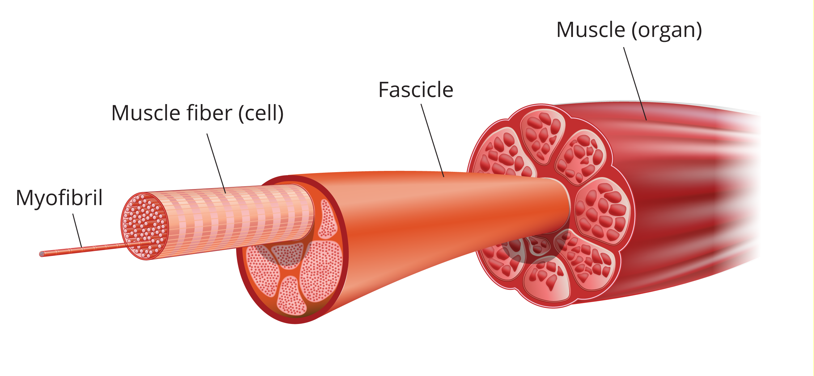
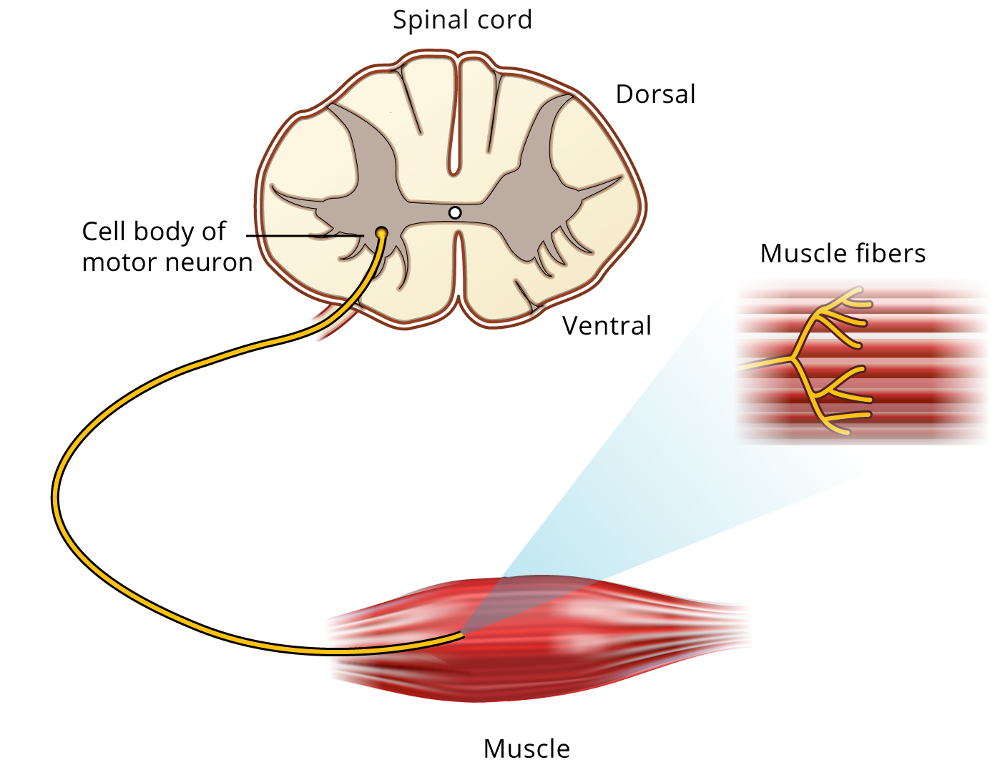

 <h1>BIOL 206 Human Anatomy & Physiology I </h1> 

 <h2> Electromyography (EMG) Demonstration</h2> 

# Objective

In this experiment, you will explore the electrical activity of skeletal muscle for voluntary muscle actions and will learn how to record an electromyogram, or EMG.

# Background

Nerve and muscle disorders cause the muscles to react in abnormal ways.
Measuring the electrical activity in muscles and nerves can help detect
the presence, location and extent of diseases that damage muscle tissue
(such as muscular dystrophy) or nerves (such as amyotrophic lateral
sclerosis: ALS or Lou Gehrig's disease). In the case of nerve injury, the
actual site of nerve damage can often be located.

Skeletal muscles do the majority of the work for locomotion and support of the animal skeleton. The skeletal
muscles produce movement, maintain posture, and assist with body
temperature maintenance, among other actions (Figure 1).

{:width="443" height="205"}
*Figure 1. Skeletal muscle structure*

A typical skeletal muscle contains thousands of muscle fibers. Each
individual fiber is innervated by a branch of a motor axon. Under normal
circumstances, a neuronal action potential activates all of the muscle
fibers innervated by the motor neuron and its axonal branches. The motor
neuron, together with all of the individual muscle fibers that it
innervates, is termed a motor unit (Figure 2). This activation process
involves (1) the initiation of an action potential in a peripheral neuron, (2)
conduction of the action potential along the nerve fiber, (3) release of
neurotransmitter at the neuromuscular junction, and (4) depolarization
of the muscle membrane with resultant contraction of the muscle fibers.

{:width="387" height="298"}
*Figure 2. The components of a motor unit*

During a contraction, there is synchronous activity in a number of fibers in the same muscle. The electrical signal
recorded from a contracting muscle is called an electromyogram, or EMG.
The EMG provides a depiction of the timing and pattern of muscle
activity. The raw surface EMG signal reflects
the electrical activity of the muscle fibers active at that time.

Imagine a crowd of a thousand people. At first, everyone is quiet, and you might be able to listen to a single person. But soon many start to speak. As more people try to talk, it becomes harder to hear individual voices, or even to count the number of people talking at once. Once many people are talking, you can only estimate the number of people talking by checking the volume of the noise. This is what we do with EMGs.

Motor units fire asynchronously and it is sometimes possible, with
exceedingly weak contractions (a quiet crowd), to detect the contributions of individual
motor units to the EMG signal. However, as the strength of the muscular
contraction increases the density of action potentials
increases and the raw signal at any time may represent the electrical
activity of **perhaps thousands of individual fibers**.

In this demonstration you will see two versions of the signal. The raw EMG signal represents the total electrical current from all of the motor units under the electrodes on the skin. This is equivalent to recording a crowd of people speaking - it's a lot of noise. The other signal is a processed recording (a signal processing known as the root mean square (RMS)), which smoothes out individual spikes and makes the time course of changing activity much clearer - this is equivalent to just measuring how loud a crowd is across time.

In this demonstration you can examine two features of muscle contraction 
 
1. **Muscle coactivation**: a phenomenon in which contraction of a muscle leads to more minor activity in the antagonist muscle to stabilize the joint.
2. **Motor unit recruitment**: one way that the nervous system can trigger a muscle to increase force production is by activating more motor units (and muscle fibers). This is like more people in a crown talking.

# Required Equipment

-   LabChart software
-   PowerLab Data Acquisition Unit
-   5 Lead Shielded Bio Amp Cable
-   Shielded Lead Wires (5 Snap-on)
-   Dry Earth Strap (or extra electrode)
-   Disposable ECG Electrodes
-   Alcohol Swabs
-   Three to four A&P books of similar weight (about 1 kg/2.2 lbs each)

# Procedure

## Equipment Setup and Electrode Attachment
Your instructor may have completed the equipment set up already, in which case jump down to **step 5**.

1.  Make sure the PowerLab is turned **off** and the USB cable is
    connected to the computer.
2.  Connect the 5 Lead Shielded Bio Amp Cable to the Bio Amp Connector
    on the front panel of the PowerLab (Figure 3). The hardware needs to
    be connected **before** you start the LabChart Software.
3.  Attach the Shielded Lead Wires to the Bio Amp Cable (may already be attached). Attach Disposable Electrodes to the end of all 5 wires (if the dry earth strap is available, attach it to the green "Earth" wire).
4.  Turn on the PowerLab.
5.  Launch **LabChart**. In the **Welcome Center**, find the *Electromyography* experiment, open the settings folder, and select *Voluntary Change Settings*. **NOTE: You should close LabChart and reopen this settings file to reset for new recordings.**
6.  Remove any jewelry from the volunteer's hand and arm. You will be placing electrodes on the volunteer's skin covering the biceps and triceps muscles using Figures 3 and 4 as a guide. Thoroughly cleanse the skin with an alcohol pad which will reduce the skin's electrical resistance. 

{:width="321"     height="255"}
*Figure 3. Equipment Setup for PowerLab 26T*

1.  Attach the electrodes (and Earth strap if used) to the volunteer. Channel 1 will lead to the biceps (place the negative \[white\] wire 2-3 cm above the positive \[black\] wire on the biceps), Channel 2 will lead to the triceps (place the negative \[red\] wire 2-3 cm above the positive \[brown\] wire). The Earth (green) should go on the volunteers wrist of the same arm attached to either the dry earth strap or another electrode. Refer to Figure 3 for proper placement.

## Exercise: Coactivation and Voluntary Change in Contractile Force

In this exercise, you will examine changes in voluntary muscle
contraction and how contractile force changes with increasing demand.
**NOTE** that any movement will add noise to the recordings so it's important that all recordings be performed under **isometric** conditions.

1. Have the volunteer **stand** in a relaxed position with his/her elbow bent 90° and palm facing upward. The volunteer's other hand should grasp the wrist of the recorded arm. Make sure the volunteer is facing away from the monitor.
2. Click **Start** in the lower right of the screen to start recording.
3. Have the volunteer make a strong contraction of the biceps muscle. This is done by bending the recorded arm further while resisting this movement with the other arm. While the contraction is happening, **Stop** the recording. 
4. Right-click on the *Biceps* recording and select *Autoscale channel*. The y-axis of the recording will automatically adjust to make the recording fill the screen vertically. 
5. Repeat steps 3 and 4 for the *triceps* muscle and channel.
6. **Start** recording. Have the volunteer make a strong contraction of the biceps while resisting with their other arm, then **switch** to a strong contraction of the triceps while resisting. They should alternate 3-4 times between biceps and triceps contractions.
7. Have the volunteer return to his/her original relaxed position with the elbow at 90° and palm up.
8. **Start** recording. The large vertical line in Chart View will help you indicate the change in procedure. Do the following while recording.
9. Type *one book* on the keyboard (this will appear in a small text window above the recordings). Hit the Enter key (which will place that comment on the recording) **AND** place one A&P book on the hand of the subject. They should hold position for about three seconds. Then remove the book (the volunteer should stay in position while the recording continues!)
10. Repeat this process with two books, then three, and then four books to give a series of increasing weights. Type the number of books, Enter, then add the books recording for 3 seconds each time. The volunteer should never change position.
    

# Analysis
Use the directions below to analyze the data you just recorded and to answer the questions in your lab assignment (if your lab instructor has assigned it).

1.  Examine the data in the Chart View. The top to channels show the RMS traces - the measurement of total volume - for the two muscles. The bottom two channels show the raw recordings.
2.  Scroll to the left of the recording using the scrollbar. You can use the "big mountain" button in the lower right to zoom in on the x-axis. You should find the area where the volunteer was alternating between trying to flex and extend their elbow.
3.  Select **Autoscale all channels** from the Commands menu if necessary.
4.  Use the mouse cursor to highlight (click and drag) a small section that shows when the volunteer was trying to **flex** their elbow. Which muscle should be most active then?
5.  When you have highlighted that area, go to the **Commands** menu, and select **Add to Data Pad**.
6.  Now highlight a section when the volunteer was trying to **extend** their elbow.
7.  Select **Add to DataPad**
8.  Scroll to the right to find your comment about *one book*. If the **Biceps RMS** trace is above or below the view, right-click on the trace and select **Autoscale Channel**
9.  You should see something like a plateau (maybe with a slope) that lasts about 3 seconds. That's the volume of muscle activity.
10. Highlight the middle of the plateau (don't get the slopes on either side)
11. Go to the **Commands** menu, and select **Add to Data Pad**
12. Scroll across to *two books*, highlight, **Add to Data Pad**
13. Scroll across to *three books*, highlight, **Add to Data Pad**
14. Scroll across to *four books*, highlight, **Add to Data Pad** (if you did 4 books)
15. Go to the **Window** menu, and select **Data Pad**
16. There you will see a spreadsheet with two columns, the *mean* for the areas you highlighted for Biceps RMS and Triceps RMS. There should be at least 6 rows. 
    1.  The first is your highlight for **flexion**.
    2.  The second is your highlight for **extension**.
    3.  The third and on is **one book**, **two books**, **three books**, etc.
17. Write down those values in the table in your notebook.
