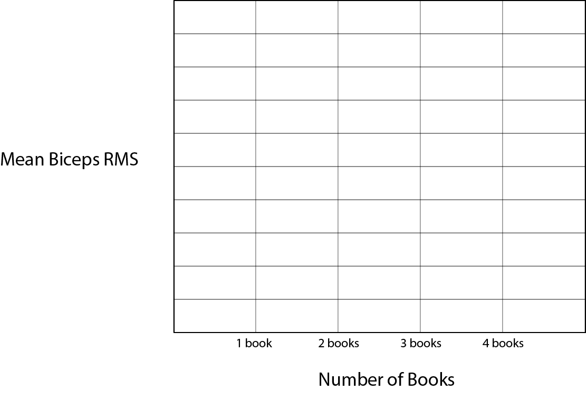

 <h1>BIOL 206 Human Anatomy & Physiology I </h1> 

 <h2> Electromyography (EMG) Lab Report</h2> 

My first & last name is: _______________________________________

| **Activity** | **Biceps RMS** | **Triceps RMS** |
|--------------|----------------|-----------------|
|**Elbow flexion**|              |                 |
|**Elbow extension**|           |                 |
|**one book**|                  |                 |
|**two books**|                 |                 |
|**three books**|               |                 |
|**four books**|                |                 |

Based on the values you recorded in the table above, and your observations, answer the following questions.

1. During **elbow flexion**, which muscle is the prime mover and which is the antagonist? How did their EMG values compare?
&nbsp;  
&nbsp;  
&nbsp;  
2. During **elbow extension**, which muscle is the prime mover and which is the antagonist? How did their EMG values compare?
&nbsp;    
&nbsp;  
&nbsp;  
4. The antagonist was somewhat active in both activities. Why might that occur if it's antagonizing the intended action?
&nbsp;  
&nbsp;  
&nbsp;  
5. Use the empty graph below to plot the **Biceps RMS** values for the different books. 

5. Describe the pattern you see in the graph. How does the muscle create more tension to hold more weight? 