# ECG & Heart Sounds
In this experiment, you will learn how to record an electrocardiogram, or ECG, and will examine the relationship between the ECG and the characteristic sounds of the heart. Your data will be compared to that of the class for analysis. *Written by staff of ADInstruments.*
# 
# Background
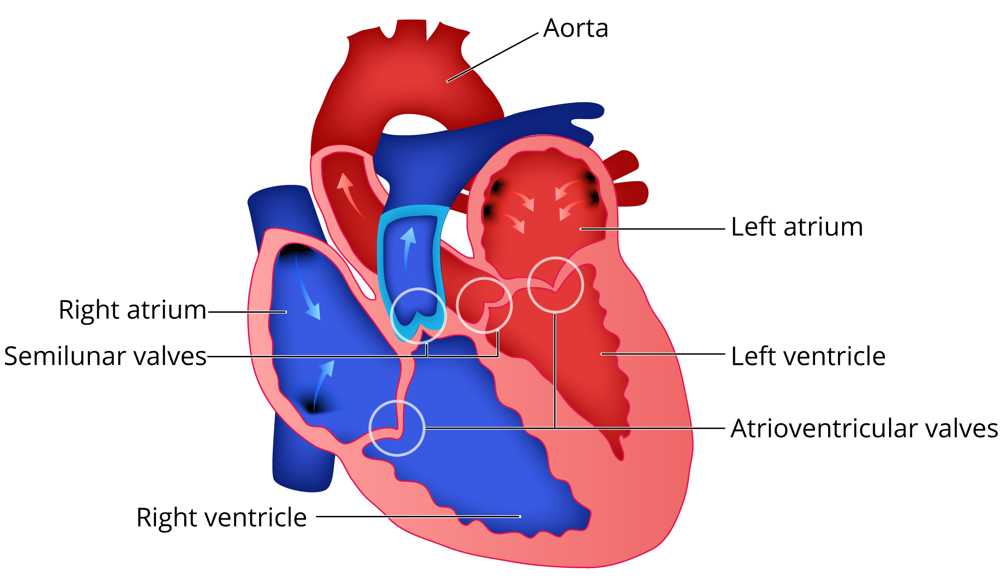{:width="444" height="260"}

The heart is a dual pump that circulates blood around the body and through the lungs. Blood enters the atrial chambers of the heart at a low pressure and leaves the ventricles at a higher pressure. The high arterial pressure provides the energy to force blood through the circulatory system. Figure 1 shows a schematic of the organization of the human heart and the circulatory system. Blood returning from the body arrives at the right side of the heart and is pumped through the lungs. Oxygen is picked up and carbon dioxide is released. This oxygenated blood then arrives at the left side of the heart, from where it is pumped back to the body. *Figure 1. Schematic of Human Heart and Circulatory System* Cardiac contractions are not dependent upon a nerve supply, but the central nervous system can affect cardiac rhythm; innervation by the parasympathetic (vagus) and sympathetic nerves modifies cardiac rhythm. The sinoatrial (SA) node, a group of specialized cardiac muscles fibers, acts as the pacemaker for the heart. These cells rhythmically produce action potentials that spread through the muscle fibers of the atria. The resulting contraction pushes blood into the ventricles. The only electrical connection between the atria and the ventricles is via the atrioventricular (AV) node. The action potential spreads slowly through the AV node, thus allowing atrial contraction to contribute to ventricular filling, and then rapidly through the AV bundle and Purkinje fibers to excite both ventricles (Figure 2).

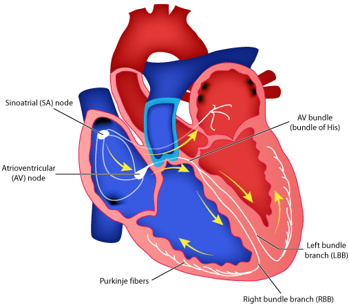{:width="303" height="263"}

*Figure 2. Components of the Human Heart* The cardiac cycle involves a sequential contraction of the atria and ventricles. The combined electrical activity of the different myocardial cells produces electrical currents that spread through the body fluids. These currents are large enough to be detected by recording electrodes placed on the skin. The regular pattern of peaks during one cardiac cycle is shown in Figure 3. The components of the ECG can be correlated with the electrical activity of the atrial and ventricular muscle:
-   The P-wave is produced by atrial depolarization.
-   The QRS complex is produced by ventricular depolarization; atrial
repolarization also occurs during this time, but its contribution is insignificant.
-   The T-wave is produced by ventricular repolarization.
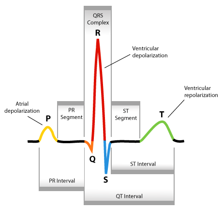{:width="297" height="278"}
*Figure 3. One cardiac cycle showing the P wave, QRS complex and T wave.* The action potentials recorded from atrial and ventricular fibers are different from those recorded from nerves and skeletal muscle. The cardiac action potential is composed of three phases: a rapid depolarization, a plateau depolarization (which is very obvious in ventricular fibers) and a repolarization back to resting membrane potential (Figure 4).

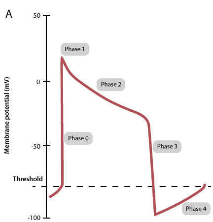{:width="264" height="275"}

*Figure 4. A typical ventricular muscle action potential.*
### Heart valves and heart sounds
Each side of the heart is provided with two valves, which convert the rhythmic contractions into a unidirectional pumping. The valves close automatically whenever there is a pressure difference across the valve that would cause backflow of blood. Closure gives rise to audible vibrations (heart sounds). Atrioventricular (AV) valves between the atrium and ventricle on each side of the heart prevent backflow from ventricle to atrium. Semilunar valves are located between the ventricle and the artery on each side of the heart, and prevent backflow of blood from the aorta and pulmonary artery into the respective ventricle. The closure of these valves is responsible for the characteristic sound produced by the heart, usually referred to as a 'lub-dub'(or lub-dup) sound. The lower-pitched 'lub' sound occurs during the early phase of ventricular contraction. This is produced by closing of the atrioventricular (mitral and tricuspid) valves. These valves prevent blood from flowing back into the atria. When the ventricles relax, the blood pressure drops below that in the artery, and the semilunar valves (aortic and pulmonary) close, producing the higher-pitched 'dub' sound. Malfunctions of these valves often produce an audible murmur, which can be detected with a stethoscope.
### The cardiac cycle
The sequence of events in the heart during one cardiac cycle is summarized in Figure 5. During ventricular diastole, blood returns to the heart. Deoxygenated blood from the periphery enters the right atrium and flows into the right ventricle through its open atrioventricular (AV) valve. Oxygenated blood from the lungs enters the left atrium and flows into the left ventricle through its open AV valve. Filling of the ventricles is completed when the atria contract (atrial systole). In the resting state, atrial systole accounts for some 20% of atrial filling. Atrial contraction is followed by contraction of the ventricles (ventricular systole). Initially, as the ventricles begin to contract, the pressure in them rises and exceeds that in the atria. This closes the AV valves. But, until the pressure in the left ventricle exceeds that in the aorta (and pressure in the right ventricle exceeds that in the pulmonary artery), the volume of the ventricles can not change. This is the so-called isovolumic phase of ventricular contraction. Finally, when the pressure in the left ventricle exceeds that in the aorta (and the pressure in the right ventricle exceeds that in the pulmonary artery), the aortic and pulmonary valves open and blood is ejected into the aorta and pulmonary arteries. As the ventricular muscle relaxes, pressures in the ventricles fall below those in the aorta and pulmonary artery, and the aortic and pulmonary valves close. Ventricular pressure continues to fall and once it has fallen below that in the atria, the AV valves open and ventricular filling begins again.

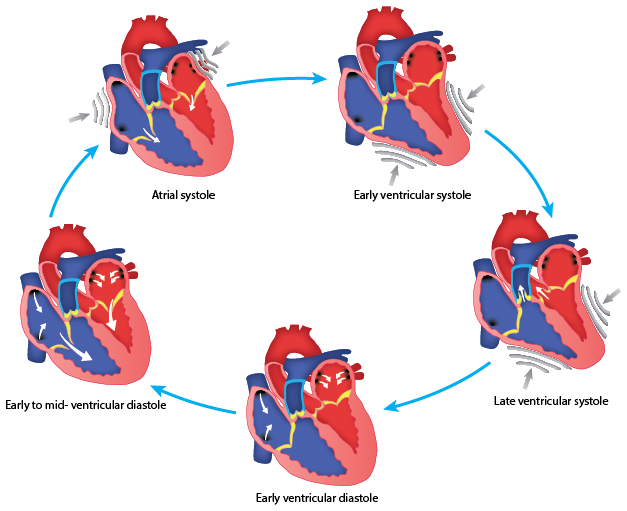{:width="389" height="317"}

*Figure 5. Cardiac Cycle* Changes in a variety of parameters during one cardiac cycle are summarized in a figure introduced by Wiggers. A modified form of this is shown in Figure 6. The importance of this representation is that it allows you to see the temporal relationships between the different parameters.
{:width="352" height="375"}
*Figure 6. A Wiggers\' diagram.*
# Required Equipment
-   LabChart software
-   PowerLab Data Acquisition Unit
-   5 Lead Shielded Bio Amp Cable
-   Shielded Lead Wires (3 Snap-on)
-   Disposable ECG Electrodes
-   Abrasive Gel or Pad
-   Alcohol Swabs
-   Gauze or cotton ball (or similar material)
-   Push Button Switch
-   Cardio Microphone
-   Ballpoint pen
-   Stethoscope
-   Elastic bandage or Medical tape
# Procedure
### Equipment Setup and Electrode Attachment
1.  Make sure the PowerLab is turned off and the USB cable is connected
to the computer.
2.  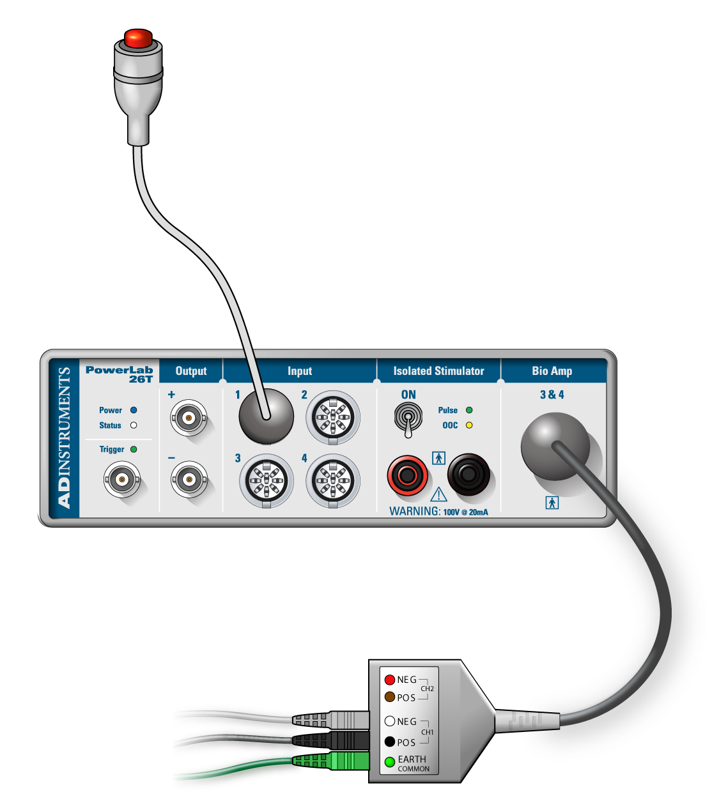{:width="262"     height="292"}
Connect the Push Button Switch to Input 1 on the front panel of the PowerLab and the 5 Lead Shielded Bio Amp Cable to the Bio Amp Connector on the front panel (Figure 7). The hardware needs to be connected before you open the settings file. *Figure 7. Equipment Setup for PowerLab 26T*
3.  Attach the Shielded Lead Wires to the Earth, CH1 NEG, and POS of the
Bio Amp Cable. Channel 1 positive will lead to the left wrist, Channel 1 negative will lead to the right wrist, and the Earth will lead to the right leg. Refer to Figure 8 for proper placement, but do not attach them to the volunteer. Follow the color scheme on the Bio Amp Cable.
4.  Remove any jewelry from the volunteer's hands, arms, and right leg.
Use the ballpoint pen to mark small crosses on the skin on the forearms and right ankle area. Use Figure 8 as a guide. Abrade the skin with Abrasive Gel or Pad. This is important as abrasion helps reduce the skin's resistance. After abrasion, clean the area with an Alcohol Swab to remove the dead skin cells. Wait for the skin to dry, and stick the Disposable Electrodes to the skin (Figure 8). **Note:** Do not place the electrodes over the major muscles because muscle activity interferes with the signal recorded from the heart.
5.  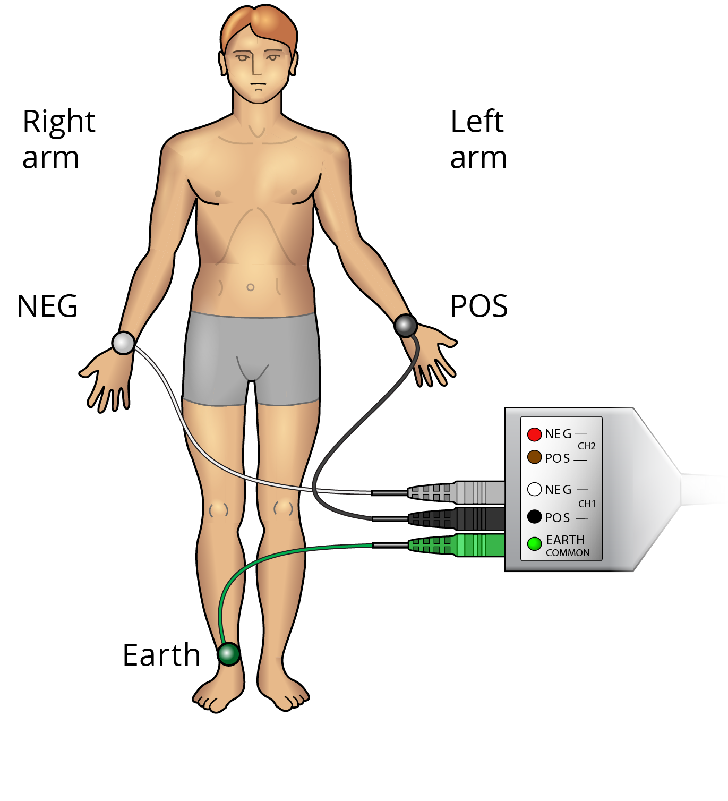{:width="228"     height="251"}
Attach the lead wires to the electrodes (CH1 POS to left wrist, CH1 NEG to right wrist, Earth to right leg). Check that all three electrodes are properly connected to the volunteer and the Bio Amp Cable before proceeding. Turn on the PowerLab. *Figure 8. Electrode Placement*
### Exercise 1: Recognizing Artifacts
In this exercise, you will observe the effects of slight movement on the ECG.
1.  Launch LabChart and open the settings file "Heart Sounds Settings"
from the **Experiments** tab in the **Welcome Center**. It will be located in the folder for this experiment. ```{=html} <!-- --> ```
6.  Have the volunteer sit in a relaxed position with their arms at rest
and hands in their lap to minimize signal artifacts from movement. Make sure they are facing away from the monitor.
7.  Select **Bio Amp** from the Channel 3 Channel Function pop-up menu.
(This is the ECG channel as Channel 2 is hidden from view.) Observe the signal and adjust the range in the dialog so that the maximal electrical response occupies about one half to two-thirds of the full scale. ***Note:** If the ECG cannot be seen, check that all three electrodes are attached correctly. If the signal is noisy and indistinct, you may want to use an alternative electrode placement. Connect the positive electrode to the left upper arm, negative electrode to the right upper arm, and Earth to the right wrist. Remember to avoid the major muscles of the arm.*
8.  **Start** recording. Remind the volunteer to remain relaxed and as
still as possible. Make sure the volunteer is still facing away from the monitor. Prepare a comment with "hand movement". Have the volunteer open and close his/her hands. Immediately add the **comment**. Have the volunteer move his/her hands and cross his/her arms in different ways. Add a **comment** each time stating the type of movement. **Stop** recording after 30 seconds.
9.  Briefly look at the data. You should now understand why it is
important for the volunteer to remain as still as possible throughout the recording. Save your data. Do not close the file.
# Analysis
### Exercise 1: Recognizing Artifacts 
1.  Examine the data in the Chart View. **Autoscale**, if necessary.
Note how different types of movements cause artifacts in the recording.
### Exercise 2: ECG in a Resting Volunteer
In this exercise, you will record an ECG in a resting volunteer.
1.  Have the volunteer return to a relaxed position.
2.  Using the same file as before, **Start** recording. Add a
> **comment** with "exercise 2, resting ECG." Record the ECG for one > minute.
3.  Save your data when you are finished recording. Do not close the
> file.
# Analysis
### Exercise 2: ECG in a Resting Volunteer
1.  Examine the data in the Chart View. Use the **View Buttons** to set
the horizontal compression to 5:1. Scroll through the data to observe the regularly occurring ECG cycles.
2.  Use the **Marker** and **Waveform Cursor** to measure the amplitudes
and durations of four P waves, QRS complexes, and T waves from the ECG trace.
-   To measure the amplitudes place the **Marker** on the baseline
immediately before the P wave. Then move the **Waveform Cursor** to the peak of the wave.
-   To measure the durations place the **Marker** at the start of the
wave or complex and position the **Waveform Cursor** at the end of the wave or complex.
3.  Record these values in Table 1 of the Data Notebook on Page 11 of
this document. Find the mean amplitude and duration for each phase of the cycle.
4.  Place the **Marker** before a QRS complex and use the **View
Buttons** to compress the view horizontally to 50:1. Move the **Waveform Cursor** to the right until roughly a 15 second difference is shown in the Rate/Time display (this will appear as ∆15s). Count the number of QRS complexes between the Marker and the Waveform Cursor. Multiply this number by four to calculate resting heart rate in beats per minute (BPM).
5.  Use the **View Buttons** to set the horizontal compression to 10:1.
Measure the time interval (in seconds) between three pairs of adjacent R waves using the **Marker** and **Waveform Cursor** (R-R time interval). For each interval, calculate the heart rate using the equation below:   6.  Record these values  Table 2 of the Data Notebook on Page 11.  7.  Collect data from each group  the class. Record these values      Table 3 of the Data Notebook on page 12.  ### Exercise 3: ECG and Heart Sounds  In this exercise, you will listen to the heart sounds  the volunteer and compare these to the ECG. Heart sounds are soft, so make sure all noise around the volunteer is kept to a mimum.  1.  Usg the same file as before, select **Input Amplifier** from the     > Channel 1 Channel Function pop-up menu. Press and release the Push     > Button Switch several times. An obvious deflection should be seen.     > If not, adjust the range to obta a deflection that is at least     > one quarter of the full scale.  2.  Have the volunteer place the bell of the stethoscope on the left     > side of the chest, usg the right hand (Figure 9). This should be     > done under the volunteer's shirt.  3.  Have the volunteer move the stethoscope to different positions until     > the student listeng through the stethoscope hears clear heart     > sounds. When the heart sounds are found, have the volunteer hold     > the stethoscope  place while the student listeng to the heart     > sounds conducts the recordg.  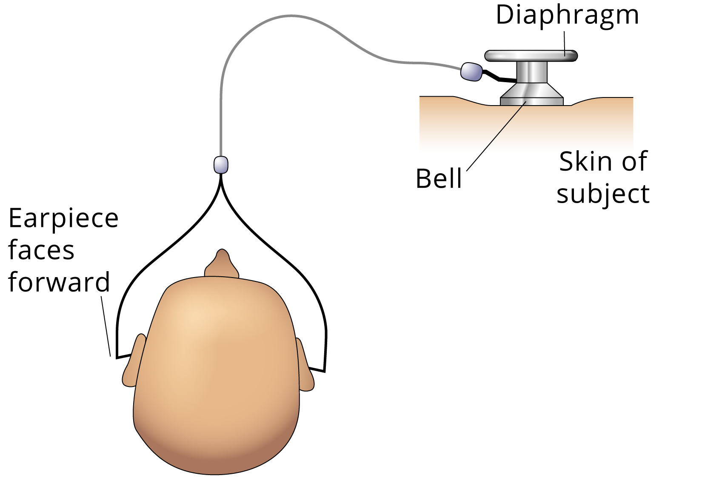{:width="261" height="180"} *Figure 9. Stethoscope Placement*
4.  **Start** recording. Add a **comment** with "exercise 3."
5.  Press the Push Button Switch on hearing the 'lub' sound, and release
> it on 'dup.' Repeat this for at least five heart beat cycles.
6.  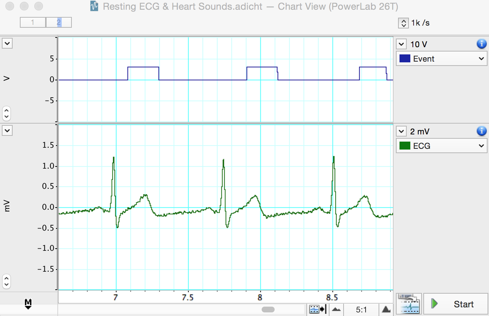{:width="349"     > height="226"}
Save your data when you are finished > recording. It should resemble Figure 10. *Figure 10. Sample Data*
# Analysis
### Exercise 3: ECG and Heart Sounds
1.  Examine the data in Chart View. Click-and-drag on the Time axis to
**select** two to three cardiac cycles, and examine them in **Zoom View**.
2.  Note the correlation between the event and ECG signals.
    -   If the protocol was followed correctly, the "Event" signal
should increase very soon after the QRS complex (signaling the 'lub' sound), and the signal return to normal at or shortly after the T wave (signaling the 'dup' sound).
3.  Note any differences from the expected timing of the signal, if any.
4.  In ChartView place the **Marker** on the R wave, and place the
**Waveform Cursor** on the beginning of the "Event" signal increase. Note the time between these two events (Figure 11).
5.  Place the **Marker** on the T wave and place the **Waveform Cursor**
on the beginning of the "Event" signal decrease. Note the time between these two events.
6.  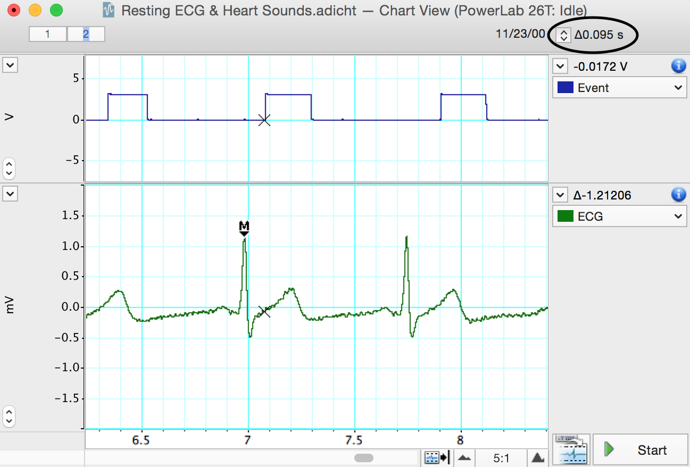{:width="333"     height="226"}
Record these values in Table 4 of the Data Notebook. *Figure 11. Analysis of time between R wave and "Event" signal increase*
### 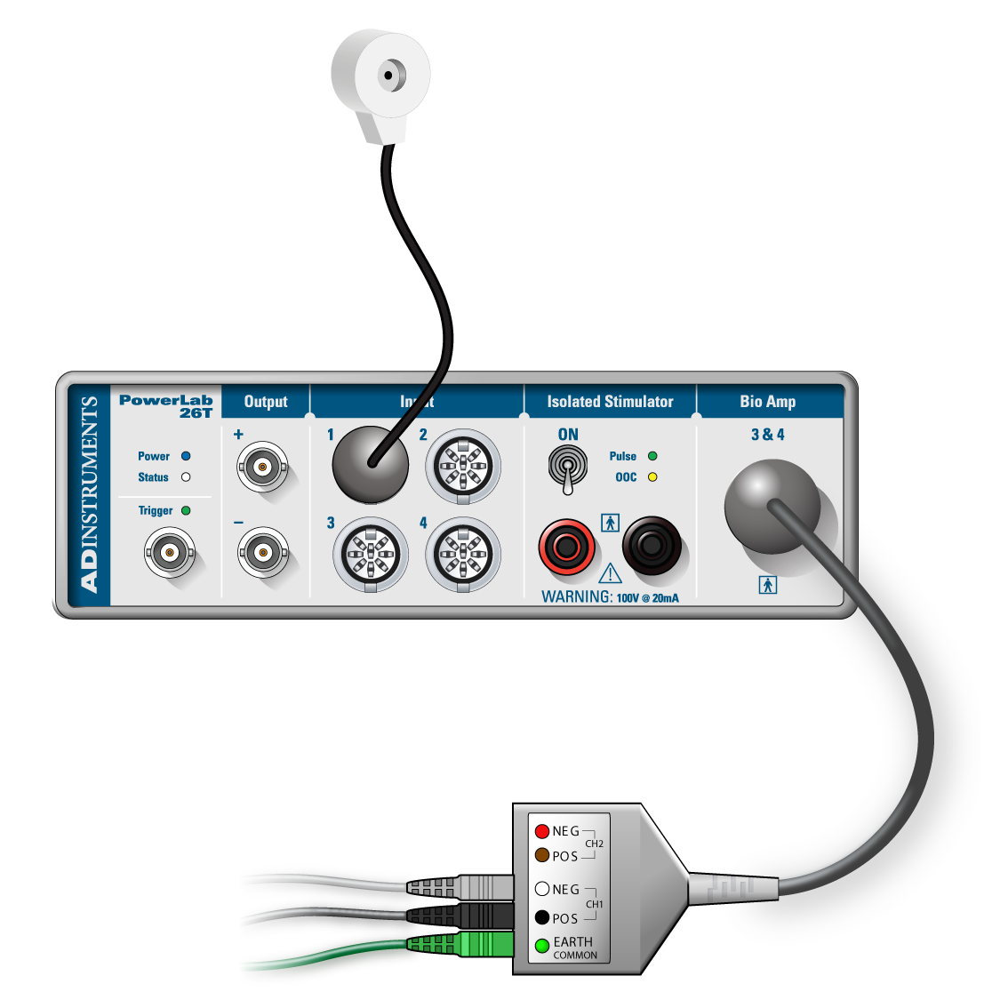{:width="244" height="244"}
### Exercise 4: ECG and Phonocardiography
In this exercise, you will use a Cardio Microphone placed over the chest wall to record the heart sounds, which allows the heart sounds to be displayed graphically in real time. This eliminates the human error seen in the previous exercise.
1.  Remove the Push Button Switch from the PowerLab and connect the
Cardio Microphone to Input 1 on the front panel of the PowerLab (Figure 12). The hardware needs to be connected before you open the settings file.
2.  Open the settings file "Phonocardiography Settings" from the
**Experiments** tab in the **Welcome Center**. It will be located in the folder for this experiment.
3.  Have the volunteer place the Cardio Microphone on the left side of
the chest against the skin with the opening facing the chest wall.
4.  **Start** recording and have the volunteer move the Cardio
Microphone around the vicinity of the heart to get the best signal possible. When ready, **Stop** recording, and attach the Cardio Microphone to the volunteer with an elastic bandage or medical tape. ***Note:** It is important to attach the Cardio Microphone to the subject instead of holding it as the hand introduces considerable noise into the recording.*
5.  Have the volunteer sit in a relaxed position, facing away from the
monitor. Remind the volunteer not to move during the recording.
6.  When ready, **Start** recording. Record for 15 seconds, and
**Stop**. Save your data.
# Analysis
### Exercise 4: ECG and Phonocardiography
1.  Examine the data in the Chart View, and **Autoscale**, if necessary.
> Note the relationship between the R wave and the first heart > sound.
2.  Place the **Marker** on the R wave, and place the **Waveform
> Cursor** on the beginning of the first heart sound. Note the time > between these two events (Figure 13).
3.  Repeat steps 1 and 2 for the T wave and its relationship with the
> second heart sound.
4.  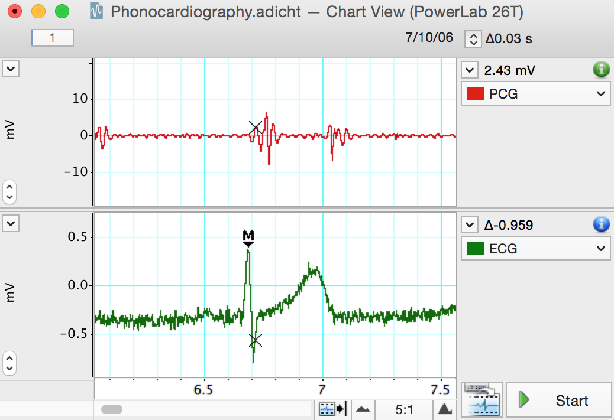{:width="452"     > height="310"}
Record these values in Table 4 of > the Data Notebook on page 12. *Figure 13. Analysis of time between R wave and first heart sound*
# Data Notebook
#### Table 1. The Cardiac Cycle
<table> <colgroup> <col style="width: 35%" /> <col style="width: 7%" /> <col style="width: 28%" /> <col style="width: 28%" /> </colgroup> <thead> <tr class="header"> <th colspan="2"></th> <th><p><strong>Amplitude</strong></p> <p><strong>(mV)</strong></p></th> <th><p><strong>Duration</strong></p> <p><strong>(s)</strong></p></th> </tr> </thead> <tbody> <tr class="odd"> <td rowspan="4"><strong>P Wave</strong></td> <td>1</td> <td></td> <td></td> </tr> <tr class="even"> <td>2</td> <td></td> <td></td> </tr> <tr class="odd"> <td>3</td> <td></td> <td></td> </tr> <tr class="even"> <td>4</td> <td></td> <td></td> </tr> <tr class="odd"> <td colspan="2"><strong>Mean</strong></td> <td></td> <td></td> </tr> <tr class="even"> <td rowspan="4"><strong>QRS Complex</strong></td> <td>1</td> <td></td> <td></td> </tr> <tr class="odd"> <td>2</td> <td></td> <td></td> </tr> <tr class="even"> <td>3</td> <td></td> <td></td> </tr> <tr class="odd"> <td>4</td> <td></td> <td></td> </tr> <tr class="even"> <td colspan="2"><strong>Mean</strong></td> <td></td> <td></td> </tr> <tr class="odd"> <td rowspan="4"><strong>T Wave</strong></td> <td>1</td> <td></td> <td></td> </tr> <tr class="even"> <td>2</td> <td></td> <td></td> </tr> <tr class="odd"> <td>3</td> <td></td> <td></td> </tr> <tr class="even"> <td>4</td> <td></td> <td></td> </tr> <tr class="odd"> <td colspan="2"><strong>Mean</strong></td> <td></td> <td></td> </tr> </tbody> </table>
#### Table 2. Heart Rate
<table> <colgroup> <col style="width: 11%" /> <col style="width: 21%" /> <col style="width: 18%" /> <col style="width: 3%" /> <col style="width: 24%" /> <col style="width: 20%" /> </colgroup> <thead> <tr class="header"> <th></th> <th><p><strong>R-R</strong></p> <p><strong>Time Interval</strong></p> <p><strong>(s)</strong></p></th> <th><p><strong>Heart Rate</strong></p> <p><strong>(BPM)</strong></p></th> <th rowspan="2"></th> <th><p><strong>QRS Complexes in</strong></p> <p><strong>15-second Period</strong></p></th> <th><p><strong>Heart Rate</strong></p> <p><strong>(BPM)</strong></p></th> </tr> <tr class="odd"> <th><strong>Pair 1</strong></th> <th></th> <th></th> <th></th> <th></th> </tr> </thead> <tbody> <tr class="odd"> <td><strong>Pair 2</strong></td> <td></td> <td></td> <td></td> <td></td> <td></td> </tr> <tr class="even"> <td><strong>Pair 3</strong></td> <td></td> <td></td> <td></td> <td></td> <td></td> </tr> </tbody> </table>
#### Table 3. Class Data for the Cardiac Cycle 
<table> <colgroup> <col style="width: 8%" /> <col style="width: 15%" /> <col style="width: 15%" /> <col style="width: 15%" /> <col style="width: 15%" /> <col style="width: 15%" /> <col style="width: 15%" /> </colgroup> <thead> <tr class="header"> <th></th> <th><p><strong>Mean</strong></p> <p><strong>P Amplitude</strong></p> <p><strong>(mV)</strong></p></th> <th><p><strong>Mean</strong></p> <p><strong>P Duration</strong></p> <p><strong>(s)</strong></p></th> <th><p><strong>Mean</strong></p> <p><strong>QRS Complex</strong></p> <p><strong>(mV)</strong></p></th> <th><p><strong>Mean</strong></p> <p><strong>QRS Duration</strong></p> <p><strong>(s)</strong></p></th> <th><p><strong>Mean</strong></p> <p><strong>T Amplitude</strong></p> <p><strong>(mV)</strong></p></th> <th><p><strong>Mean</strong></p> <p><strong>T Duration</strong></p> <p><strong>(s)</strong></p></th> </tr> </thead> <tbody> <tr class="odd"> <td><strong>Group 1</strong></td> <td></td> <td></td> <td></td> <td></td> <td></td> <td></td> </tr> <tr class="even"> <td><p><strong>Group</strong></p> <p><strong>2</strong></p></td> <td></td> <td></td> <td></td> <td></td> <td></td> <td></td> </tr> <tr class="odd"> <td><p><strong>Group</strong></p> <p><strong>3</strong></p></td> <td></td> <td></td> <td></td> <td></td> <td></td> <td></td> </tr> <tr class="even"> <td><p><strong>Group</strong></p> <p><strong>4</strong></p></td> <td></td> <td></td> <td></td> <td></td> <td></td> <td></td> </tr> <tr class="odd"> <td><p><strong>Group</strong></p> <p><strong>5</strong></p></td> <td></td> <td></td> <td></td> <td></td> <td></td> <td></td> </tr> </tbody> </table>
#### Table 4. Phonocardiography 
<table> <colgroup> <col style="width: 33%" /> <col style="width: 33%" /> <col style="width: 33%" /> </colgroup> <thead> <tr class="header"> <th></th> <th><p><strong>R Wave to</strong></p> <p><strong>First Sound</strong></p> <p><strong>(s)</strong></p></th> <th><p><strong>T Wave to</strong></p> <p><strong>Second Sound</strong></p> <p><strong>(s)</strong></p></th> </tr> </thead> <tbody> <tr class="odd"> <td><strong>Push Button Switch</strong></td> <td></td> <td></td> </tr> <tr class="even"> <td><strong>Cardio Microphone</strong></td> <td></td> <td></td> </tr> </tbody> </table>
# Study Questions
1.  **What can you say about the amplitude of the various waves in
different cardiac cycles?** ```{=html} <!-- --> ```
1.  **The P wave and the QRS complex represent depolarization of the
> atrial and ventricular muscle, respectively. Why does the QRS > complex have the larger amplitude?** ```{=html} <!-- --> ```
2.  **In the Analysis, you calculated heart rate averaged over 15
seconds and instantaneous heart rates. Explain any differences between these values.**
3.  **Are the amplitudes and durations of the various waves in different
individuals similar or different?**
4.  **Explain why the 'lub' sound occurs immediately after the QRS
complex and the 'dub' sound occurs after the T wave.**
5.  **Your recordings probably show some differences from the correct
timing of the heart sounds as judged by phonocardiography. Why do you think this happened?** Copyright © 2014 ADInstruments Pty Ltd. All rights reserved. PowerLab® and LabChart® are registered trademarks of ADInstruments Pty Ltd. The names of specific recording units, such as PowerLab 8/30, are trademarks of ADInstruments Pty Ltd. Chart and Scope (application programs) are trademarks of ADInstruments Pty Ltd. **www.ADInstruments.com**
# 