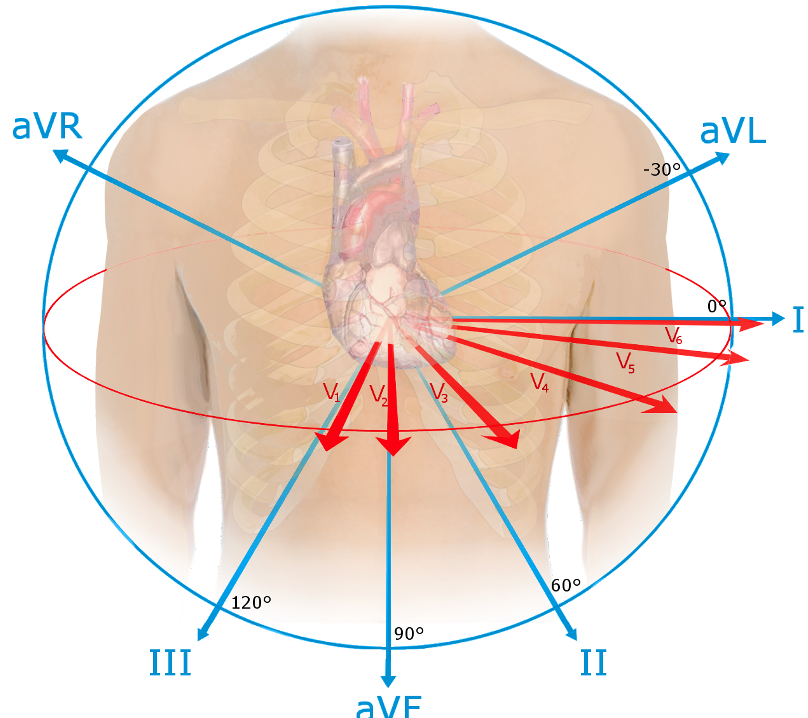
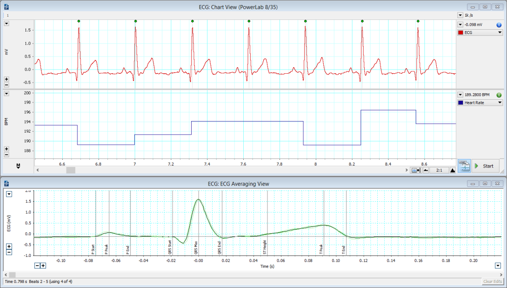
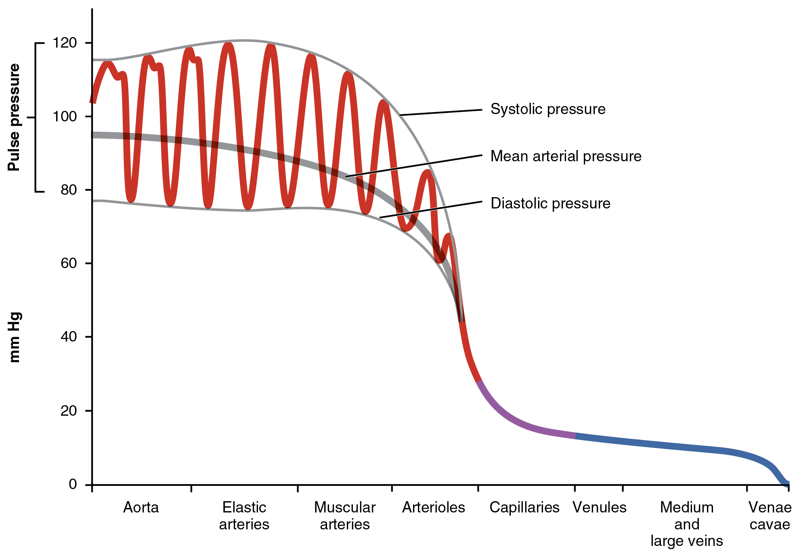

# Lab 2: The Heart - Physiology

## Preparation for lab

To get the most out of this lab you need to be prepared. The basic knowledge needed for this lab is covered in Amerman "Human Anatomy and Physiology"

+ **for EKG**: Chapter 17.3 "Cardiac Muscle Tissue Anatomy and Electrophysiology"
+ **for Blood Pressure**: 18.2 "Physiology of Blood Flow"

In addition to reading, you should review the following videos:

+ [EKG physiology basics from your book's publisher](https://mediaplayer.pearsoncmg.com/assets/V1kYPD_O_9iP5HtiqJnI_fPWbzLFOsbT).
+ [taking a blood pressure](https://youtu.be/soR8THwQzBw) (many others available online)

## Lab Activities

There are two different activities in lab. If you are sitting at a table with a computer and ADInstruments PowerLab set up, you are doing EKG for the first half. Start just below.
Otherwise, you are doing blood pressure measurements first. [Jump to that section](#blood-pressure-introduction). 

## EKG Introduction

Electrocardiography (ECG or EKG) records the summated electrical activity of the heart muscle and enables us to diagnose may heart diseases, i.e. arrhythmia (irregular heartbeats), infarction (blocked coronary blood vessels), hyperkalemia (elevated levels of potassium), and many more. Plotting the electrical activity over time results in a characteristic waveform consisting of a P-wave, QRS-complex and T-wave. Variations in this pattern indicate pathological condition. For example, the lack of a P-wave indicates a problem with the heart’s SA-node pace maker.

### How the EKG works and what the PowerLab Data Acquisition Unit does

Modern electrocardiographs are complex machines that contain a computer and algorithms to automatically analyze the collected data. But even those machines are essentially just electronic amplifiers that measure the tiny electric fields generated by the electric charges moving across the heart muscle. These amplified signals are filtered and then displayed either on a screen or with a plotter on paper.

The PowerLab system contains the necessary amplifier and filter as well as a A/D (analog-to-digital) converter which translates the voltage fluctuations in a digital signal (a series of numbers) that the computer can plot.

### Navigating LabChart

LabChart is the software that allows you to control the PowerLab unit and display the acquired data. To effectively use the LabChart system you’ll need to learn how to use the software.  
DIRECTIONS: Please follow the [Student Quick Reference Guide](https://cdn.adinstruments.com/adi-web/manuals/LabChart7_1_QRG.pdf)

### Recording an ECG

#### Electrodes and Leads

The simplest form of ECG uses 4 electrodes (one each at wrists and ankles) to measure the electric field across the heart from 3 different directions or ’leads’. These 3 directions are called the *limb leads* and they are traditionally labeled I, II, and III (see figure).

The 12 leads and directions from which an ECG measures the electrical activity of the heart. Lead I, II, and III are the limb leads and are present in the simplest ECG. The augmented limb leads aVF, aVL, and aVR are calculated. A 12-lead ECG additionally records the red vectors. (Source: Wikipedia)

From these three leads, 3 additional leads can be calculated: the three *augmented limb leads* traditionally labeled aVR, aVL, and aVF (augmented right, left, and foot). But even looking at the heart from 6 angles might not be enough to diagnose a specific problem. A cardiologist might add up to 6 additional electrodes (traditionally labeled V₁ through V₆) to bring the total to 10 electrodes and 12 different perspectives, an arrangement that is called the 12-lead EKG.

Which electrode goes where? While most modern ECG machines will tell you if an electrode is placed incorrectly, the 4 basic leads have a standardized colors and their placement is easy to remember: clouds (white right arm) over grass (green right leg), white on the right, and smoke (black left arm) over fire (red left leg).

DIRECTIONS: For this part lab we’ll follow the LabChart Human Physiology lesson *"ECG and Heart Sounds"* and fill out the provided data report sheet.

#### Tips for getting a good ECG

A good ECG looks something like the graph below. Notice that the baseline is mostly level, and there are regularly spaced peaks arising from that baseline. Notice the P-waves, the QRS complex, and the T-waves. Notice that other than those waves, line is generally smooth. This is what the ECG should look like in the calibration step.

Example of a good ECG trace recorded in lab.

A "bad" ECG lacks those things. The three most common errors are inverted or different waves and complexes; a shifting baseline (looks like the peaks are on a rising or falling slope); or high frequency noise (lots of small waves covering these bigger waves of interest). The three most common causes of a "bad" ECG are *improper connections of wires* (wrong color to the wrong electrode on the body), *subject movement* (remember: muscle create electrical fields, too!), and *poor contact between the electrodes and the skin* (usually caused by the wires pulling at the electrodes or dried-in electrodes). Use kinesiology-tape if you can’t the electrodes to stick! At each step where you are asked to confirm the quality of your ECG following recording, if it is "bad", check those three things.

#### Setup & supplies

**For each table**

- laptop
- AD Instruments PowerLab
- one ECG lead
- fresh stick-on electrodes
- gel
- kinesiology tape
- copy of  Data Report Sheet

## Blood Pressure Introduction

Blood pushes out on the walls of the blood vessels with a **hydrostatic pressure**. The pressure in the arteries varies during the cardiac cycle.  The ventricles contract to push blood into the arterial system and then relax to fill with blood before pumping once more.  This intermittent ejection of blood into the arteries is balanced by a constant loss of blood from the arterial system into and through the capillaries.  When the heart pushes blood into the arteries there is a sudden increase in pressure, which slowly declines until the heart contracts again.  

Blood pressure is at its highest immediately after the ventricle contracts (systolic pressure) and at its lowest immediately prior to the pumping of blood into the arteries (diastolic pressure).  Systolic and diastolic pressures *can* be measured by inserting a small catheter into an artery and attaching the catheter to a pressure gauge.  Such a direct measurement might be accurate, but is invasive and often inconvenient and impractical.  Simpler estimates of blood pressure can be made with acceptable accuracy using noninvasive, indirect methods.

The modern era of blood pressure measurement started with the introduction of the mercury sphygmomanometer by Scipione Riva-Rocci (1863–1937) in 1896. Instad of mercury, we now have analog or digital pressure gauges, but we still call them **sphygmomanometers**. Blood pressure is estimated using a **stethoscope** and a blood pressure cuff connected to a sphygmomanometer.  The cuff is placed on the upper arm and inflated to stop arterial blood flow to the arm in the **brachial artery**; the high pressure in the cuff collapses the artery.  The pressure in the cuff is then released slowly.  When the cuff pressure falls below the systolic pressure in the artery, blood begins to flow to the arm during part of systole, but the artery collapses again as the blood pressure drops towards the diastolic pressure.  This flow is turbulent rather than streamlined and generates sounds called **Korotkoff sounds**, which can be heard through the stethoscope. When the cuff is fully inflated and no blood is moving, no sounds can be heard. As the pressure is slowly relieved, and blood flow is first heard, the cuff pressure approximates systolic pressure.  As the cuff pressure continues to decrease and the artery regains its normal diameter, flow becomes streamlined and the sounds become muffled and then disappear.  The cuff pressure at the point of the disappearance of sound approximates diastolic pressure.

### Taking a blood pressure manually

You will practice using the manual sphygmomanometers and stethoscopes to take blood pressures of each other in pairs.

For this part, the volunteer should be seated, back against the back rest of a chair, feet flat on the floor, arms relaxed with hands in lap palms up.
 
1. Place the blood pressure cuff on the subject's arm as high as possible. It's ok to put it over thin clothing (t-shirt thickness), but sweaters and sweatshirts should be removed. Before putting it on, make sure the cuff is fully deflated.
    + Find where the tube from the bulb pump enters the cuff - this should be placed on the brachial artery (medial side of arm behind biceps muscle) with the tubes exiting distally. 
    + Wrap the cuff snugly around the arm.
2. Put the ear pieces in your ear so that they point a little anteriorly and make a complete seal in your ear canals. Make sure the bell of the stethoscope is active.  Lightly tap on the bell.  If no sound is clearly heard, rotate the bell 180° on its end piece.
3. Place the bell of the stethoscope on the brachial artery, just proximal to the elbow crease, just medial to the biceps tendon. You shouldn't hear any pulse. Hold the bell firmly in place with your second and third fingers, with your thumb on the back of the elbow.
4. With your other hand, make sure the valve on the bulb pump is closed (clockwise, not too tight), then pump the pressure up to about 180 mmHg while watching the pressure gauge. 
5. Open the valve slightly so that the pressure starts to drop about 1-2 mmHg per second. 
6. When you first hear a sharp tapping, or sometimes a quick whooshing sound, remember the reading on the gauge as the systolic pressure and let the pressure continue to drop. 
7. When all sounds stop, remember the reading on the gauge as the diastolic pressure, and then open the valve completely. 
8. Write down the pressure as *systolic / diastolic* like $120/80$
9. Wait two minutes, then repeat your measurement twice, for a total of three manual measurements. Then switch people.

### Automated blood pressure, and the effects of posture

You should also have an automated blood pressure system at your table. Sitting in the same position as before, each person should get an **automated** reading of blood pressure. While these simple systems are typically not as accurate as an experienced provider, they are fine for seeing general trends and are **much** faster than an inexperienced provider (most of you). So, for the following exercise, you *can* take manual readings, but you are also welcome to use the automated systems for speed.

This is simple. Take the blood pressure readings of the same person in multiple positions.
1. Sitting as before relaxed with back supported, feet flat, arms relaxed in lap (this is the doctor's office standard)
2. Sitting as before with arm elevated (like raising your hand)
3. Standing
4. Laying down on the table
5. Sitting as before, but immediately after taking the stairs down to the ground floor and back up, or doing 20 pushups, or 20 jumping jacks, or otherwise elevating your heart rate.

### Questions to consider

1. You took a manual blood pressure three times. How much did the readings vary?
2. How did the mean of your manual BP compare to the automated reading in the same position?
3. What affect did posture have on the readings, if any? Why might that be?
