## Objectives

1. Learn how to acquire data with teh PowerLab Data Acquisition Unit
2. Learn how to analyze Data in LabChart
3. Make simple recordings and measurements using the Finger Pulse Transducer

**Note:** The LabChart Software License is limited to the lab computers. However, you can download for free [LabChart Reader](https://www.adinstruments.com/support/software) for your personal computer operating system. This will allow you analyze data collected in the lab. Due to time constraints in lab, installing this is highly recommended.

## Background

The purpose of the PowerLab system is to acquire, store, and analyze data.  The raw input signal is in the form of an analog voltage whose amplitude varies continuously over time.  This voltage is monitored by the hardware, modified (e.g. amplified, filtered, and zeroed), and sampled at regular intervals.  The signal is then converted from analog to digital form and recorded on the attached computer.  Figure 1 shows a summary of the acquisition.  
The LabChart software usually displays the data directly; it plots the sampled and digitized data points and reconstructs the original waveform by drawing lines between the points.  Digital data can be stored for later retrieval.  The software can also easily manipulate and analyze the data in a variety of ways.

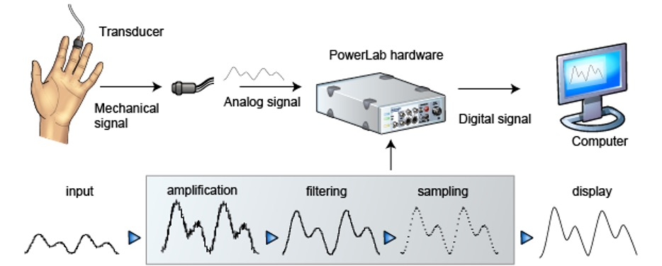

The Powerlab hardware does the amplification, filtering, and sampling. It can also generate signals, which we may use later to do things like stimulate muscle contractions. We connect *transducers* to the inputs on the front which record physiological signals and transmit them to the Powerlab. 
  
The front of PowerLab 26T is shown in Figure 2.

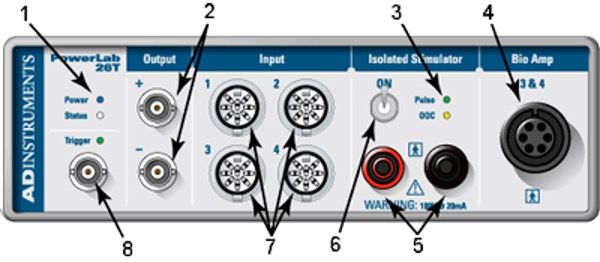

1.	Power indicator light: illuminates when the PowerLab is turned on
2.	Analog output connections: provide a voltage output in the 10 V range
  **This is NOT safe for direct connection to humans.**
3.	Isolated Stimulator status light: indicates if the Isolated Stimulator is working properly (green) or out of compliance (yellow)
4.	Dual Bio Amp input: connects a 5 Lead Bio Amp Cable to the PowerLab; reads as inputs 3 and 4
5.	Isolated Stimulator outputs: for connecting stimulating electrodes to the Isolated Stimulator
6.	Isolated Stimulator switch: turns on/off the Isolated Stimulator
7.	Pod ports: 8-pin connectors for attaching pods and certain transducers to Input; these supply a DC Power to the pods and transducers
8.	Trigger input: can be used to start or stop a recording event

## Activity
Some of the following steps may already be completed, but you should double check that the connections match the instructions.

### Equipment Set Up

1. Connect the Powerlab to power by attaching a three-pronged power cord to the back.
2. Use a USB cable to connect the Powerlab to one of the laptops
3. Connect a `finger pulse transducer` to `input 1` on the front of the PowerLab as shown in the figure below. 
   
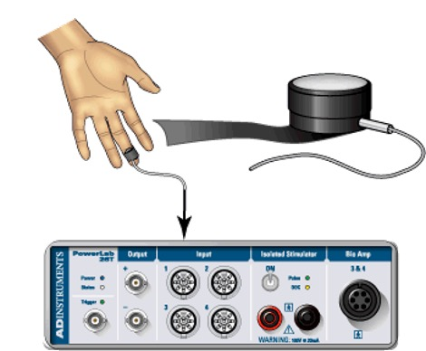

4. Turn on the power switch on the back of the PowerLab and ensure the green power light on the front illuminates.
5. Log-in to the laptop using the user name and password on the label on the laptop.
6. Use Windows search, or find on the desktop, to open `LabChart 8`. 
7. That should open the "Welcome Center". **If you get any pop up windows that say you need to update, or it can't find some file, you can cancel and/or ignore them.**

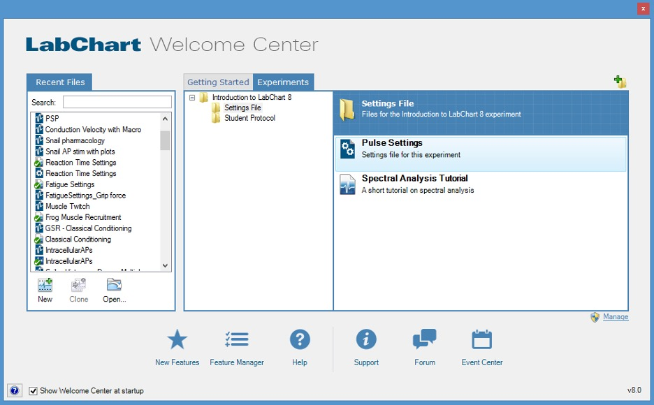

8. Click on the `Experiments` tab, and navigate to `Introduction to LabChart8`
9. Whenever you are starting a new experiment for any lab, in the Welcome Center you want to find the `Settings File` for that experiment. So now, within the Introduction folder, find the `Pulse Settings` and open it. 

### Signal Adjustments
The following steps are meant for you to get familiar with the LabChart interface regarding signal conditioning. 

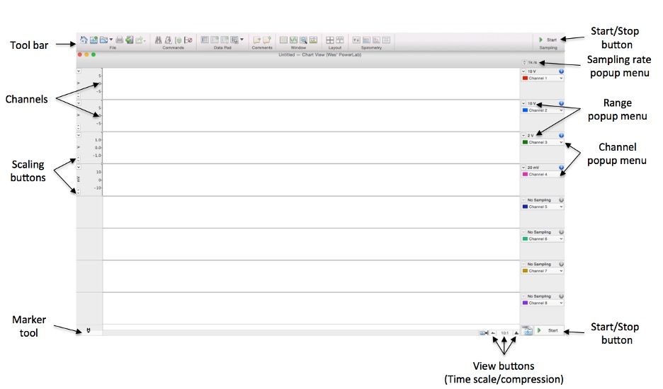

Opening the `Pulse Settings` file above should have opened a window like the figure above, but with only one row (channel) showing.

1. Pick a volunteer to act as a recording subject.
2. Place the pressure pad of the Finger Pulse Transducer on the tip of the middle finger of either hand of the volunteer.  Use the velcro strap to attach it firmly but without cutting off circulation.
    • If the strap is too loose, the signal will be weak, intermittent, or noisy.  If the strap is too tight, blood flow to the finger will be reduced causing a weak signal and discomfort. Attach it firmly so it can't slip of, but not tight enough to cause discomfort. You may need to adjust the strap in the next stage of the exercise.
3. Have the volunteer face away from the monitor.  *In most experiments, you do not want the volunteer to see the data while it is being recorded.*  Make sure the Finger Pulse Transducer cable can still reach the PowerLab while allowing the volunteer to sit comfortably, hands relaxed palms up in their lap. The Finger Pulse Transducer cannot rest on any surface.
4. The signal from many of the transducers you will use is highly variable depending on the subject, and in the case of the Finger Pulse Transducer depends on how tightly it is attached. Therefore, you  have to **adjust the range and baseline** to view the signal.
   1. Click on the `Channel 1` (or it might say `Pulse Transducer`) in the upper right of the recording channel as shown in the figure, and select `Input Amplifier`.
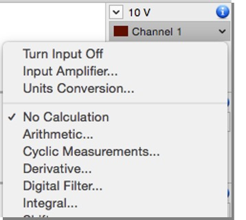
   1. The Input Amplifier dialog will appear with a continuous scrolling signal in the display area.
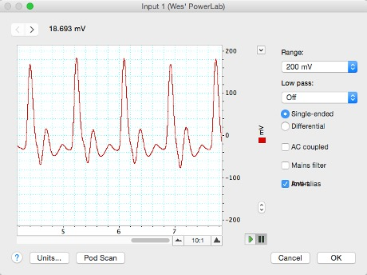
   1. To adjust the sensitivity of the channel, choose an appropriate range setting from the `Range` drop-down list in the Input Amplifier dialog.  The number displayed in the range menu indicates the maximum input voltage currently selected.
   2. Notice how as you decrease the range the vertical scale changes and the small rhythmic deflections that appear on the signal trace increase in amplitude. Continue to adjust the range setting until the deflection fills about one half to two-thirds of the data display area.    
      1. The signal from the Finger Pulse Transducer has not changed, only the sensitivity of the recording system has.  If the rhythmic signal is a series of downward deflections, click in the Invert checkbox to reverse the direction.  You do not need to apply the Low Pass filter.  
   3. Press **OK**.

### Recording Data

Time to record some sample data, and learn how to navigate your way around the data, make adjustments to the file, and add notes to it. While normally you would have the volunteer face away from the monitor, they can watch so that they can also learn how to use the software. But they should keep their hand and fingers still. 

1. Start recording by clicking `Start` in the lower right of the screen. Record the finger pulse waveform for 20 seconds. You can see seconds along the x-axis.  Your data trace should resemble that shown in the figure.  Note that Start changes to Stop while recording. After 20 seconds, click `Stop`. 
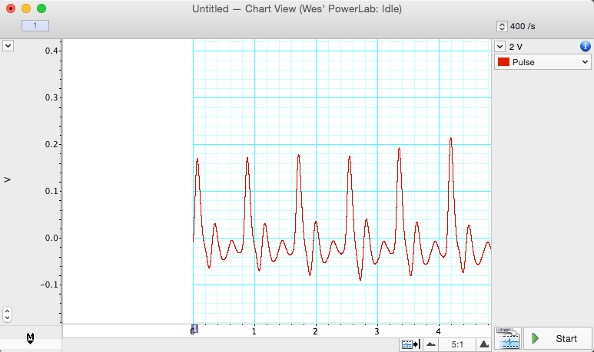
1. Move the mouse pointer about the Chart View and observe what happens.  The some values on the screen change based on where the cursor it. Think about what the different values mean and how they relate to the plot.
   1. Also notice the faint `X` that follows the cursor across the plots, but sticks to the line. This is the `Waveform Cursor`. More on that below.
2. Move the pointer over the scale at the left of the Chart View.  The pointer changes to point to the right and small arrows appear beside it.  When the pointer is over the scale, you can either stretch or move the scale by dragging the scale numbers or the scale between them.  The small arrows beside the pointer indicate what will happen. Try a few click and drags to see how the y-axis range changes. 
3. The `Scaling buttons` (up and down) are on the left side of each channel’s Amplitude axis. The up button will double the vertical scale shown, and the button will halve the vertical scale shown
4. Right-clicking in the channel will show several options for displaying data:
    + `Auto Scale Channel` will automatically adjust the y-axis so the maximum value is just larger than the maximum value of visible data in this channel. **This may be one of your most used functions!**. You can also find it in the `View` menu, and there's button for it in the toolbar.
    + Show Points as Dots and Show All Channels with Dots will show you the individual points the PowerLab is sampling.
    + If you changed the size of the data channel, Equalize Channel Heights will make all the data channels the same size again.
    + Split View inserts a divider vertically in the data creating two separate scrollable regions. This allows you to view recorded data while still monitoring new data.
    + “Add Comment, Set Marker, and Add Channel” will be covered later in this exercise.  

### Navigating Recorded Data
You know how to change the y-axis, but what about the x-axis? Some recordings will go on for minutes, rather than 20 seconds, and will not all fit on the screen.

1. Find the `View Buttons` 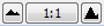 and click on the larger mountains to zoom in on the x-axis until only one or two peaks is visible.
2. Use the scroll bar to slide left and right. You can zoom back out with the smaller view button.

### More Advanced Functions
The previous work showed you how to record and navigate. But many experiments will have multiple stages, and you need to keep track of what was happening in each stage. This is where **annotation** comes in, which lets you add comments at specific points while recording.

1. Have the volunteer sit in their relaxed recording position. Or pick a new volunteer and repeat the adjustments in `Input amplifier`. 
2. `Start` recording
3. Try entering a comment by typing while the recording is happening. For example, type `sitting` and hit `Enter`. 
   1. Type `raised hands` but **DO NOT** hit `Enter`. Wait a few seconds.
   2. Tell the volunteer to raise their hands, and hit `Enter` as their hands are going up.
   3. You can pre-type comments and wait to save them to the data until the event has happened!
4. Click `Stop` to stop the recording.
5. You should see a few things for each comment:
   1. a vertical dotted line indicating the placement in time
   2. If the comment is short enough, it will be visible. 
   3. A number on the x-axis counting the comments. You can right click on this number to Edit, Delete, or Move the comment. 
6. You can also right click on the data after recording and select `Add Comment`
7. Click on the `Comment List`  button to see a list of all comments. You can click on one to navigate to that part of the recording.

### Getting instantaneous numbers from the graphs
There are two related tools to get some simple measurements directly from the data: the `Waveform Cursor` and the `Marker`. You should become familiar with both.

1. The `Waveform Cursor` is a tool that can be used to read amplitude and time values directly from a waveform on screen.
2. Move the pointer over the data trace in the Chart View and move it left to right.  A small `X` Waveform Cursor appears on the waveform at the same time value as the pointer.  As you do this, the Rate/Time shows the time at the Waveform Cursor, and the Range/Amplitude shows the amplitude of the signal at that time.
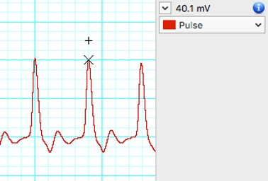
3. The Waveform Cursor is often used in conjunction with the Marker.  The Marker () is located at the bottom left of the Chart View and can be dropped on any part of the waveform to allow relative measurements to be made. 
4. Drag the `Marker` from the Marker Box to a location on the trace and release.  The Marker does not have to be placed exactly on the waveform; it will attach itself to the waveform at the time position you dropped it.
5. Move the pointer away from the Marker.  When the Marker is in use, the amplitude and time values displayed are r*elative to the marked reference point*.  This means the time and amplitude values are now displayed as differences (∆) between the Waveform Cursor and the Marker.  This is very useful for measuring the time between events or measuring the relative amplitudes of parts of a waveform.
6. As an exercise, measure the amplitude (height) of the finger pulse signal. Put the `Marker` at the bottom of a valley, and move the `Waveform Cursor` to the top of a peak. The Δ Range/Amplitude gives you the height.
7. Now measure the time in seconds from peak-to-peak.
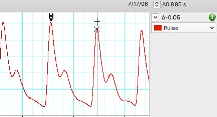
8. What is your heart rate based on the peak-to-peak measurement? You know the time between beats, so how do you get heart rate in beats / minute?

### Calculations
It's possible to have LabChart do lots of calculations automatically. The only one we'll discuss today is cyclic measurements - it can automatically detect peaks in the signals.
1. Right-click anywhere in the data channel and select `Add Channel`.  A new channel will appear in the display.
2. From the Channel 2 Channel Function pop-up menu (to the right of the trace in channel 2), select `Cyclic Measurements`.
3. In the Cyclic Measurements dialog (figure below), set the Source to Channel 1, the Measurement to Rate, and the Detection Settings Preset to Cardiovascular – Finger Pulse.  Small circles (or ‘lollipops’), known as event markers, will appear above the detected beats (also referred to as pulse peaks). Let’s make those visible in the Chart View as well by checking Event Markers under Output. They will be useful later in the experiment.
   + If none of the beats from the source channel are detected, adjust the Minimum peak height by moving the slider to the left.  You want the minimum sensitivity necessary to detect beats but want to avoid noise from being detected mistakenly.  If too many peaks are detected (event markers appear where they should not), move the slider to the right.  
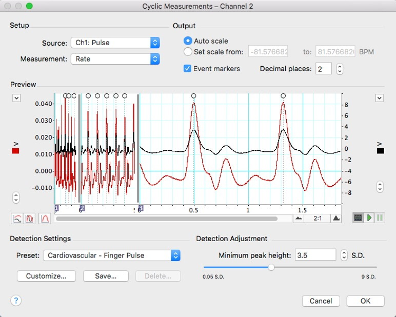
4. Once you have made appropriate changes to the Cyclic Measurements dialog click OK and note how the second channel now shows a continuous measurement of pulse rate from the pre-recorded data.
5. With the pulse transducer still attached, click `Start` and note how after a short delay the cyclic measurement channel calculation will update as new data is recorded.

### Data Pad
To record important data, you can write down the values from the `Waveform Cursor`. But that could lead to errors. It's much better to save data into the `Data Pad`. The contents of the Data Pad can be edited, copied (to other software) or exported as text files.
1. Open the Data Pad by clicking the button in the Toolbar. 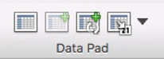
2. `Smart Tile` the windows so you can see the Data Pad and Chart View windows side-by-side by clicking the button in the toolbar.
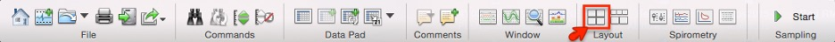

#### Data Pad Calculations
Each column of the first sheet in the Data Pad (the Data Pad Sheet) allows for a variety of calculations.
1. Open the **Data Pad Column A Setup dialog** for column A by clicking on the column heading in the Data Pad.
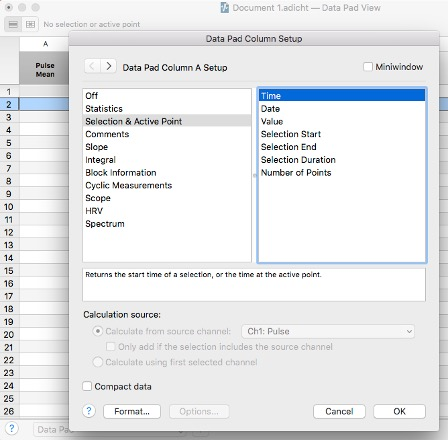
2. Set the calculation for column A to **Selection & Active Point / Time** (as shown in the figure above). This will return the start time of a selection in the Chart View, or the time at the active point.
3. Now open the **Data Pad Column B Setup dialog** by clicking on column B’s heading in the Data Pad.
4. Set the calculation for column B to **Cyclic Measurements / Average Cyclic Rate**. In ‘`Calculation source`’ make sure that you select the ‘`Pulse`’ channel (Channel 1) as the source channel. This will return the average heart rate for that Cyclic Measurement cycle.
5. Click `OK` to close the dialog.
6. In Chart View click on a peak and note how the Data Pad calculates the defined parameters in the first row.
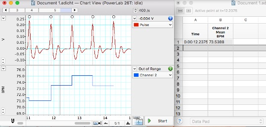
7. Use the cursor to click and drag on the graphs to select a section of time. The height doesn't matter, this is selecting a time along the x-axis. 
8. In the toolbar, find the button for `Add to Data Pad`. Select a different part of the graph, and add it to data pad again. You should see rows fill in in the Data Pad. 

## Saving Data
You can save the recorded data as an `.adicht` file which allows analysis later on. If you've saved data to the Data Pad, you should save that to a text file or csv, either of which could be opened in Google Sheets or Microsoft Excel for analysis.

1. Go to the File menu, and select `Save` (or `Save as`). Save your data as something with your name, and save it to the Documents folder on the computer you are on.
2. Close LabChart completely. 
3. In the File Explorer, find your file in the Documents folder. Double click on it to open it. 

